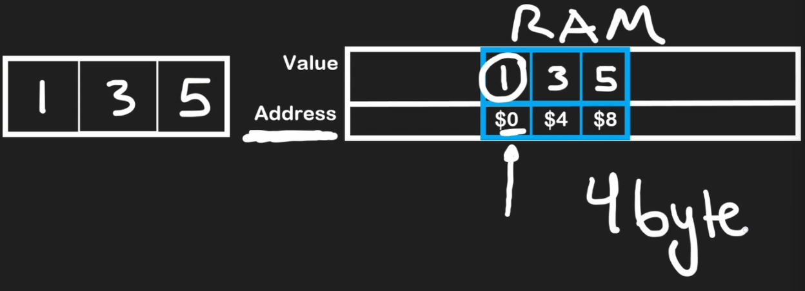
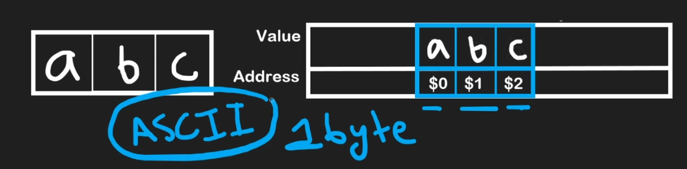
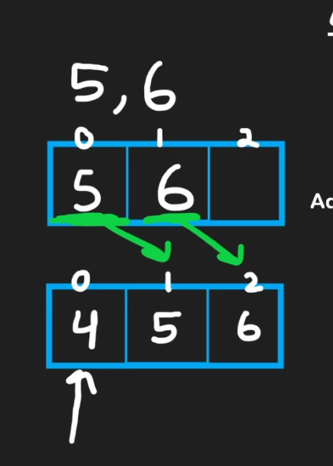
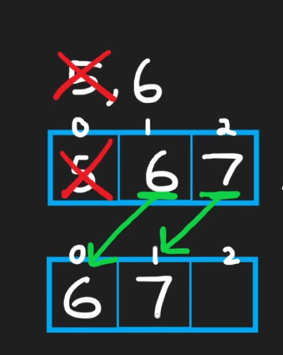
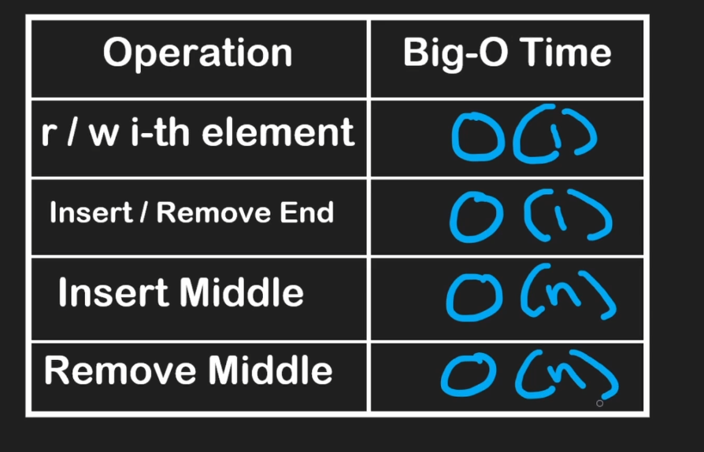
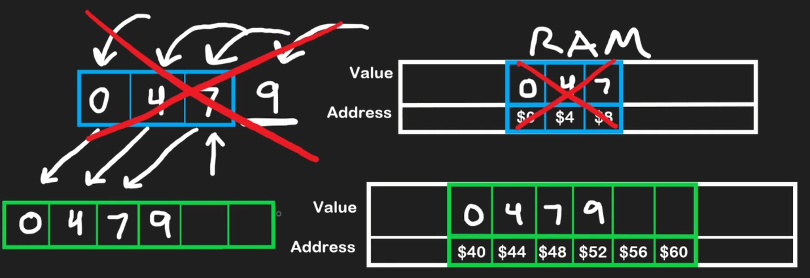
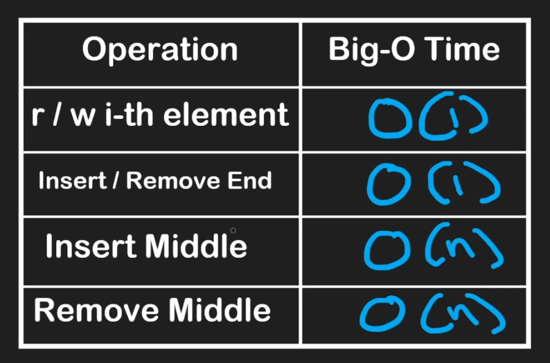
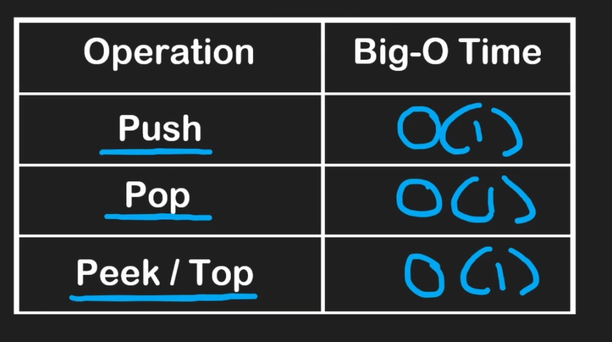
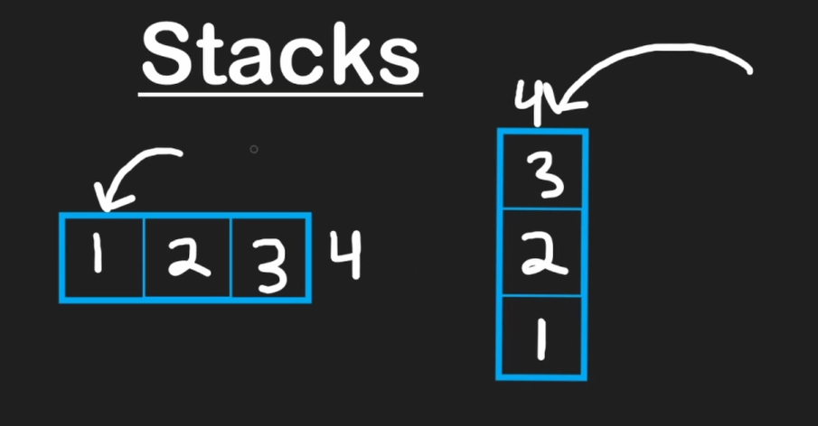

# Arrays

- Data structure: it’s a way of structing data inside of RAM memory
- RAM: measured in bytes (1 byte = 8 bits)
    - A bit it’s a digit that can be 0 or 1
    - Contiguous block of data
    - It has two components: values and address
    - Random Access Memory: we can access any address and read its value at constant type
- Usually integers are stored as 4 bytes in RAM (32 bits)
- Arrays are always stored contiguous in RAM

## Static Arrays

- Have fixed size
- Read a value: O(1) - it’s a instant operation even in the worst case
- Write a value: O(1) - it’s a instant operation because the size is fixed and we have the indexes
- Insert a value in a filled position (unshift): O(n) - because we need to shift all elements first to be able to insert a value in the beginning
    

    
- Remove a value (shift): O(n)
    

## Dynamic Arrays

- Dynamic size
- In the internal implementation there’s a pointer that indicates which index is the last position
- Push and pop are O(1)
- If we push a new value when the dynamic array is already full, we need to create a brand new array in memory, copy the existing elements, push the new value and free the previous array from memory
- Each time we increase the dynamic array size, it doubles its size instead of just adding one more available position, to avoid doing this costly operation every time
- Creating a new array and copying each element it’s O(n), but since it’s a operation that will not happen everytime because we are doubling the array size, we can still say that pushing a value it’s O(1) in average (amortized time complexity)

## Stack

- Common use-case for dynamic arrays
- The last element added to the stack will be the first element removed from the stack
- LIFO data structure → Last In, First Out

