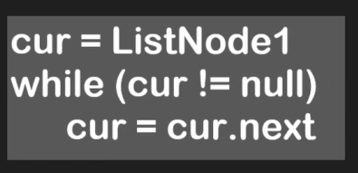
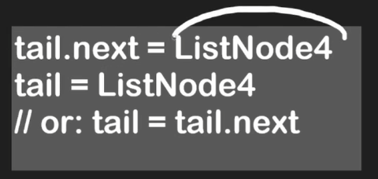
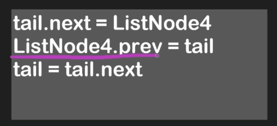
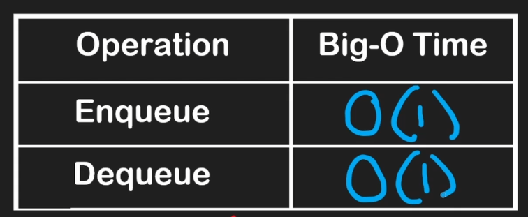

# Linked Lists

- ListNode or Node object that encapsulates two properties:
    - value
    - next → reference to the next Node object or null
- The nodes can be randomly stored in memory and the nodes are connected through pointes/references
- Not contiguous
- Iterate through the linked list → O(n)

- We can have two pointers: head and tail
- Pushing an node to the end of the list → O(1):

- Removing a element in the middle → O(n)

## Doubly linked lists

- There’s a prev pointer that points to the previous node
- The first node will have the prev pointer set to null
- The last node will have the next pointer set to null
- Insert at tail:

- Removing a node → O(1)
- Add a node to the end of the list → O(1)
- Read a random element → O(n)
- Can be used to implement stacks, but it’s better to stick with dynamic arrays for that because the read of random element in arrays is O(1), while in doubly linked lists is O(n)

## Queues

- FIFO - First in, first out
    - The first element that we push is going to be the first element to be removed
- Usually have two methods:
    - Enqueue: push element to the end
    - Dequeue: remove element from the beginning
- We should use linked lists for implementing queues because we can remove elements from the beginning in O(1), while arrays don’t let you remove it in O(1) - because the elements need to be shifted

