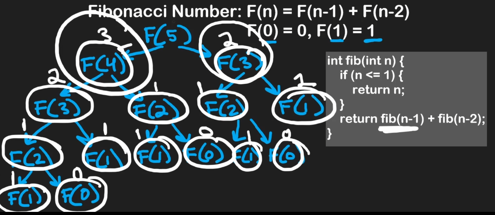

# Recursion

## Factorial (One-branch)

- Recursion is used to solve subproblems within a problem
- n! = n * (n - 1)!
- 5! = 5 * 4!
- 5! = 5 * 4 * 3 * 2 * 1
- Factorial calculation only has one decision
- Factorial is O(n) time complexity and O(n) space complexity
- If we use a loop to calculate the factorial, the space complexity would be O(1)

## Fibonacci (Two-branch)

- F(n) = F(n-1) + F(n-2)
- F(0) = 0, F(1) = 1
- The iterative approach is O(n)
- The recursive approach we need to divide the calculation in two subproblems every time (two-branches)
- The number of layers of the decision tree will be N
- To get the number of values in the entire decision tree is $2^n$ → basically the number of calculations needed. It isn’t 100% precise, but it’s enough for understanding the time complexity

