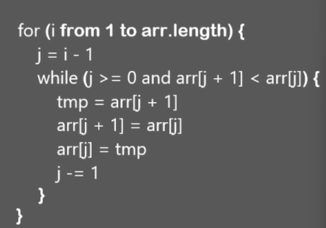
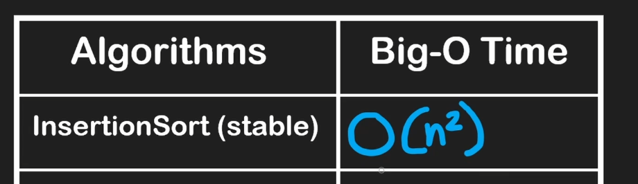
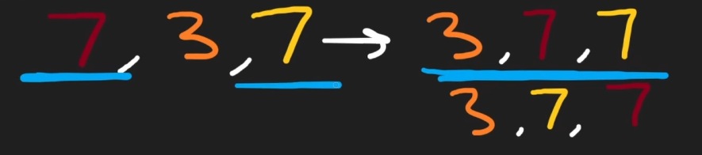
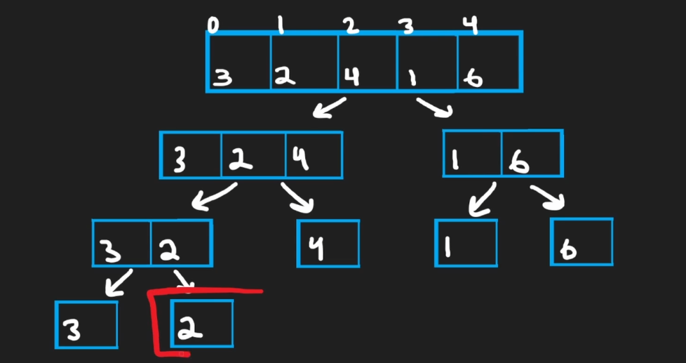
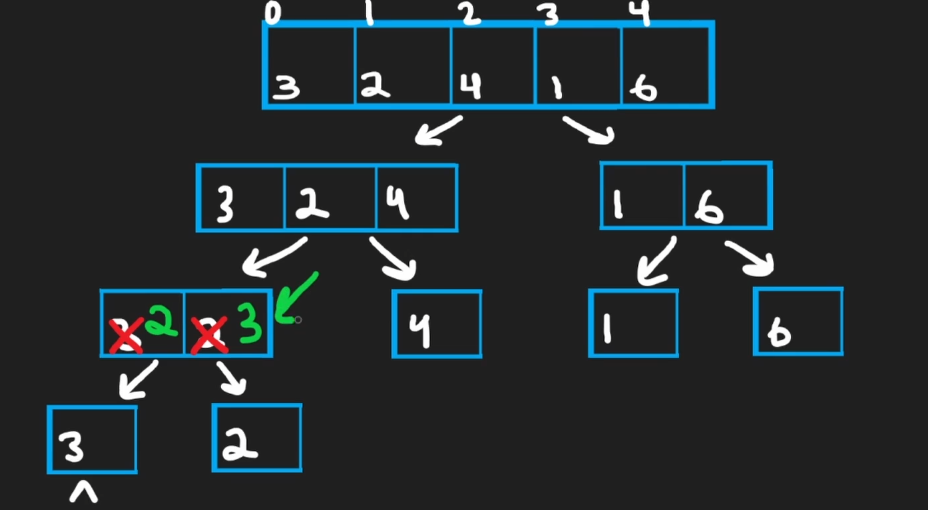
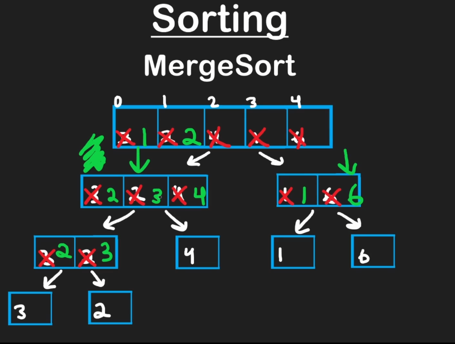
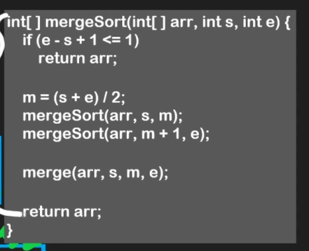
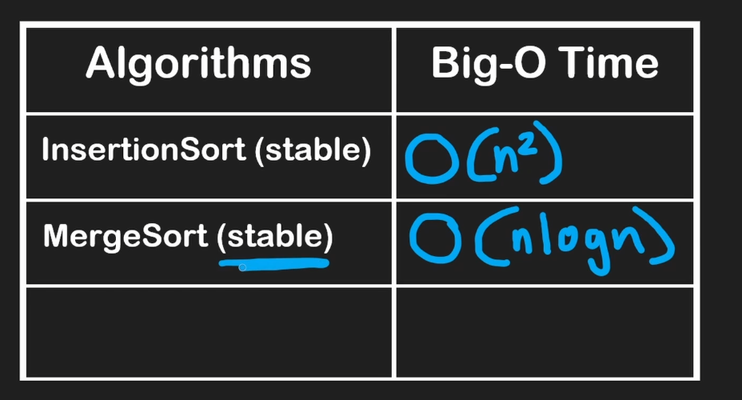
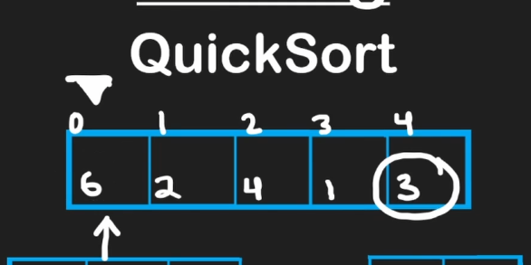
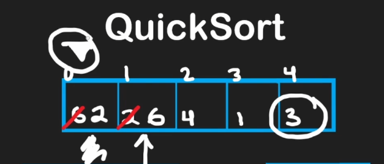

# Sorting

## Insertion Sort

- Break the problem into subproblems
- Sort the first value (it’s sorted by default), then sort the first 2 values, then sort the first 3 values
- Iterative solution - start in the second position and check if the current element is less than the previous element, if so then swap them. After that we need to check if the element is less than the previous element again, if so then swap them again and keep doing that

## Stable sorting algorithm vs unstable

- Stable sorting algorithms preserves the original order of elements when there’s a tie
- Insertion sort is stable

- Unstable algorithms can preserve the order sometimes, but there’s no guarantee

## Merge Sort

- Split the array into subproblems by dividing it by half each time and solve that subproblem before we solve the “parent” subproblem
- It’s a two-branch recursion
- The base case is when the array only has one element because it’s sorted by default
- When we have two sorted arrays, we can merge them in sorted order to have a single one
    - We’ll have 3 pointers: one for the left array, other for the right array and another for the output array (original array)
    - Then we compare the elements from left and right array to check which one is smaller and insert it in the output array. If the right element is less, then we copy that to the output array and increment the right pointer

## Quicksort

- It’s similar to Merge Sort, but instead of splitting the array and sorting each part and merging them, we pick a “pivot” (usually it’s the last element)
- We iterate over all the values on the left side of the pivot value and compare it with it
- Every value that is less than or equal to the pivot value will be placed on the left partition of the array (first half)
- Every value that is greater than the pivot value will be placed on the right side
- We’ll have two pointers: one to iterate through the array (1) and another to say where we should place the next value that is less than or equal to the pivot value (2)
- When the iteration finishes, the next step is to swap the pivot array with element that is in the pointer 2)
- It’s not an stable algorithm

- If we split the array in equal halves, the time-complexity will be O(nlogn) - like merge sort - but there are cases (worst case) that we will not split into equal halves and the complexity will be
O($n^2$)

## Quick Select

- In average it’s O(n), but the worst case scenario is O($n^2$)
- It’s similar to quick sort, we select a pivot and iterate over the array to partition the array to have the elements less than or equal to pivot on the left side and the elements greater on the right side
- Then swap the pivot with the pointer element to place it in the middle of the partition, to have all elements less than or equal to pivot in the left and all elements greater in the right side
- After that, we check if the number we are looking for is in the left partition or the right partition
    - If it’s in the left partition, we call the algoritmth again recursively with just the left partition
    - if It’s in the right partition, we call the algorithm again recursively with just the right partition
    - If the element that we are looking for is in the pivot position (after the swap step), then we found our element (return it)

## Bucket Sort

- It can run in O(n) even in the worst case
- But we can’t use it every time, because there are some constraints that needs to be met in order to be able to use this algorithm
- We use it for small range of values in the array and it’s pretty rare to need it
- It’s not a stable algorithm
- We create an array with the same size of distinct values that we have in the input array and initialize every position as zero
- Each position of the new array will be a “bucket” where we store how many times that number appear on the input array
- Loop through the input array counting the occurrences
- Then we iterate over the “counts” array and, for each position (n), we insert the number of occurrences in the input array
- We’ll have a pointer to point where we should insert the element

